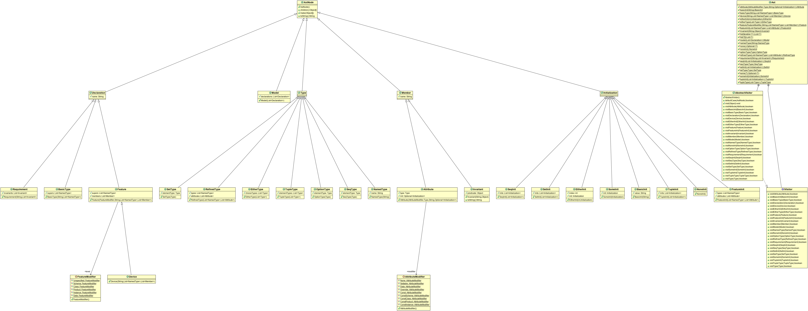
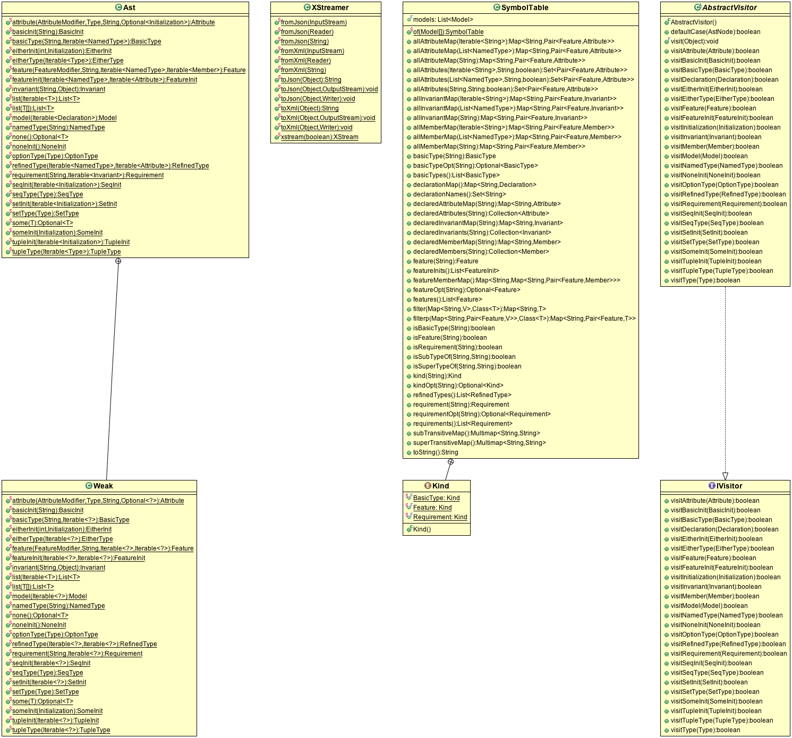

Language Specification, Representation, and API
###############################################

This section describes how device models can be specified in the Domain Specific
Language (DML) encoded in Scala (Device Modeling in Scala -- DMS). 
Note that because there are multiple ways to 
express the device models in Scala, the specification described here should not 
be treated as prescriptive. Instead, the specification is provided as a 
guideline for people that are not familiar with Scala (but familiar with Java) 
in order for the model to be accepted by the DML Scala Model Extractor; some 
possible variations are described on how one can express a model differently.

We will specify the context free grammar of the subset of Scala that is part of 
DML using the Extended Backus-Naur Format (EBNF). Specifically:

.. |String| replace:: :javadoc:`String <java/lang/String.html>`

* Double quotes (``"`` ... ``"``)  delimit tokens
* Midbar (``|``) separates production alternatives
* Parenthesis ``(`` ... ``)`` groups rules
* Star character (``*``) denotes zero or more repetition of rules
* Plus character (``+``) denotes one or more repetition of rules
* Square brackets (``[`` ... ``]``) delimit optional rules
* ``ID`` denotes Java-like identifiers; a hint that starts with an underscore 
  (``_``) may be given to qualify what the identifier should refer to.
  For example, ``ID_basic`` indicates that it is an identifier of a basic type.
* Angle brackets (``<`` ... ``>``) denotes Scala entities whose specifications
  are not formally specified in the grammar. For example,  
  ``<scalaExp : java.lang.String(S)>`` denotes a Scala expression whose type
  resolves to some |String| constant ``S`` such as ``"abc"``, which
  is equivalent to ``"a" + "bc"`` because the Scala compiler optimizes such
  static expression to a constant at compile time, hence, it not only knows that
  its type is |String|, but also that its value is ``"abc"`` at  runtime. 
  The design intentions behind angle bracket'd rules are explained as 
  the production rules using the angle brackets are discussed.

Representation and API
**********************

.. |Ast| replace:: :dml:`dml.ast.Ast <ast/Ast.java>`

.. |IVisitor| replace:: :dml:`dml.ast.IVisitor <ast/IVisitor.java>`

.. |AVisitor| replace:: :dml:`dml.ast.AbstractVisitor <ast/AbstractVisitor.java>`

.. |XStreamer| replace:: :dml:`dml.serialization.XStreamer <serialization/XStreamer.java>`

.. |SymbolTable| replace:: :dml:`dml.symbol.SymbolTable <symbol/SymbolTable.java>`

.. |Extractor| replace:: :dms:`dms.ModelExtractor <ModelExtractor.scala>`

In addition, for the grammar productions, we describe DML implementation classes 
and API; when referring to such classes, we use
:dml:`dml <>` as a shorthand for the :dml:`edu.ksu.cis.santos.mdcf.dml <>` package.
Similarly, we use :dms:`dms <>` as a shorthand for the 
:dms:`edu.ksu.cis.santos.mdcf.dms <>` package.
The DML Abstract Syntax Tree (AST) Java classes are defined in the  
:dml:`dml.ast <ast>` package with associated AST constructor methods 
in |Ast|, symbol table API in |SymbolTable|, 
visitor API in |IVisitor| and |AVisitor|,
and XML de/serialization API in |XStreamer|.
The |Extractor| 
`Scala object <http://en.wikibooks.org/wiki/Scala/Objects>`__ 
provides methods to extract DML AST from DMS models.

Furthermore, we also describe AST well-formedness throughout the discussion of
various parts of DMS; some of the well-formedness are enforced by the Scala
compiler, while some additional ones are enforced by the |Extractor|, and some 
are (to be) done after the extraction process. 
 

   DML AST UML Class Diagram

   DML AST Constructor, Symbol Table, Visitor, XML de/serialization API UML Class Diagram

Nullity and Immutability
========================

All method parameters in all the API are non-null by 
default; these are declared in the respective package infos 
(:dml:`ast <ast/package-info.java>`, 
:dml:`serialization <serialization/package-info.java>`, 
:dml:`symbol <symbol/package-info.java>`). In addition, all objects 
are designed to be immutable (object state changes may occur but not 
observable through the API).

Each AST node class stores its children in ``public`` ``final`` 
fields. In addition, each node class inherits from the 
:dml:`dml.ast.AstNode <ast/AstNode.java>`, which provides a 
``children`` method that returns an array of the node's children;
the returned array can be mutated but it does not affect the AST node.

AST String Representation
=========================

Calling the ``toString`` method on an AST node object produces a valid Java and 
Scala code (under the appropriate import context) as a |String| that builds 
structurally equivalent AST object. 

Model
*****

.. productionlist:: DMS
   model               : `package` `imports` `declaration`*
   package             : "package" ( ID "." )* ID
   imports             : `importdms` `import`*
   importdms           : "import" "edu" "." "ksu" "." "cis" "." "santos" "." "mdcf" "." "dms" "." "_"
   import              : "import" ( ID "." )* ID [ "." "_" ]
   declaration         : `basicType` | `feature` | `requirement`

A model may be specified in multiple Scala source files. 
For each file, a model starts with a `package <#grammar-token-package>`__ 
declaration, followed by `import <#grammar-token-import>`__ declarations and 
declarations of `basic types <#grammar-token-basicType>`__, 
`features <#grammar-token-feature>`__, and 
`requirements <#grammar-token-requirement>`__. 
That is, it is assumed that models are
specified in a package other than the Scala or Java "default" package.
The grammar recommends importing all elements (specified using ``_`` instead of 
``*``  like in Java) defined in the :dms:`dms <>` 
:scala:`Scala package <119>` and :dms:`dms.package <package.scala>` 
`package object <http://www.artima.com/scalazine/articles/package_objects.html>`__, 
which defines DML primordial types, :scala:`implicit conversions <130>`,
and a :scala:`macro <overviews/macros/overview.html>`, 
which will be described in the appropriate subsequent sections below.
 
In addition, it recommends importing `basic types <#grammar-token-basicType>`__ 
or `features <#grammar-token-feature>`__ defined in 
different packages; note that Scala allows import declarations to appear in many
places, including inside class declarations and expression blocks among others.

One can alternatively choose to not import any package elements and always use 
the fully qualified name of package elements.

AST Classes and Construction
============================

A model is represented using the :dml:`Model <ast/Model.java>` AST class which
has an :javadoc:`Iterable <java/util/List.html>` 
of :dml:`Declarations <ast/Declaration.java>`, which can be either
:dml:`BasicType <ast/BasicType.java>`, :dml:`Feature <ast/Feature.java>`, or
:dml:`Requirement <ast/Requirement.java>`.

One can construct a model by calling the |Ast| ``model`` 
static method as illustrated in the following :dmdocj:`example <ExModel.java>`:

.. literalinclude:: /../../java/ExModel.java
   :language: java
   :emphasize-lines: 8
   :linenos:

The above example creates a model with an empty list of declarations, and then
prints out the model and the model's declarations. The |Ast| ``list``
methods are helper methods that when given either a variable or an 
:javadoc:`Iterable <java/lang/Iterable.html>` number of objects, they create an 
(immutable) list containing the provided objects. 

Notice that at :dmdocs:`Line 8 <ExModel.scala\#L8>`, we need to use
``Ast.<Declaration> list()`` instead of just ``list()``. That is because
``list()`` without a parameter type supplied for its element type returns
``List<Object>``, which is incompatible with ``model``'s parameter that expects
a list of :dml:`Declarations <ast/Declaration.java>`. To address this issue,
one can use |Ast|. ``Weak`` API that have the same set of AST construction 
methods, but with weaker compile-time parameter types that are checked at 
runtime; 
:javadoc:`IllegalArgumentException <java/lang/IllegalArgumentException.html>`
will be thrown if the runtime types are not what expected.  
Below is an :dmdocj:`example <ExModel.java>` that illustrate the
|Ast|. ``Weak`` API:

.. literalinclude:: /../../java/ExModelWeak.java
   :language: java
   :linenos:

Below is a similar :dmdocs:`example <ExsModel.scala>` written in Scala;
thanks to Scala's type inference, |Ast| API work
without a problem as can be seen at :dmdocs:`Line 13 <ExsModel.scala\#L13>` 
(of course ``Weak`` would work as well):

.. literalinclude:: /../../scala/ExsModel.scala
   :language: scala
   :emphasize-lines: 13,17-21
   :linenos:

We mentioned previously in the `AST String Representation`_ Section that
the AST ``toString`` method produces a code that construct structurally 
equivalent AST. This is illustrated at 
:dmdocs:`Lines 17-21 <ExsModel.scala\#L17-21>` where
``m``'s ``toString`` is used to construct a Scala code
as |String| at Line 19 (``s"`` ... ``"`` is a
:scaladoc:`Scala string interpolator </overviews/core/string-interpolation.html>`)
along with the import declaration at Line 18; 
:sutil:`Reflection <Reflection.scala>`'s ``eval`` method takes the |String| 
code, compiles it (at runtime), and then invokes the compiled code to produce a 
structurally equivalent model ``m2`` with respect to ``m`` as shown in at Line 21.

AST Extraction
==============

Instead of constructing AST manually by hand, |Extractor| provides 
``extractModel`` methods that extract DML AST from DMS models.
More specifically, given an array of package |String| names, they return
the DML AST model that is represented in the packages and their sub-packages.

Below is an :dmdocj:`example <ExModelExtractor.java>` illustrating the use of 
|Extractor| API to extract DMS models from the :dmsx:`dms.example <>` package and
its sub-packages:

.. literalinclude:: /../../java/ExModelExtractor.java
   :language: scala
   :linenos:

.. |ClassLoader| replace:: :javadoc:`ClassLoader <java/lang/ClassLoader.html>`

Variants of the |Extractor| ``extractModel`` methods are provided to extract 
a model using a specific |ClassLoader| and 
|Extractor| ``Reporter`` for custimizing warning and error notifications during
the extraction process. By default, the |ClassLoader| that loads the 
|Extractor| is used, and warning and errors are printed to the console (output
and error streams, respectively).

Model Well-Formedness
=====================
A set of models are well-formed if all user-defined 
`basic types <#grammar-token-basicType>`__,
`features <#grammar-token-feature>`__, and 
`requirements <#grammar-token-basicType>`__ are well-formed. 

SymbolTable
===========

Given a set of models, the |SymbolTable| ``of`` method creates an instance of
|SymbolTable| that provides various methods to retrieve DML entities
such as `basic types <#grammar-token-basicType>`__,
`features <#grammar-token-feature>`__,
`attributes <#grammar-token-attribute>`__, and
`invariants <#grammar-token-invariant>`__
in the models or by their fully-qualified name.

Below is an :dmdocj:`example <ExModelSymbolTable.java>` to illustate the 
construction of |SymbolTable| and its |String| representation:

.. literalinclude:: /../../java/ExModelSymbolTable.java
   :language: scala
   :linenos:

The reader is referred the SymbolTable Javadoc 
`online <http://mdcf.github.io/doc/dml/edu/ksu/cis/santos/mdcf/dml/symbol/SymbolTable.html>`__
to see what queries are available through the API.

AST and Symbol Table De/serialization
=====================================

The |XStreamer| API provides AST and symbol table serialization to XML 
and deserialization back from XML using XStream_ with custom converters that 
makes the produced XML representation easier to read as well as its size.
More specifically, it provides ``toXml`` and ``fromXml`` static methods for 
converting to/from |String|, |Writer|/|Reader|, or |OutputStream|/|InputStream|.   

.. _XStream: http://xstream.codehaus.org

.. _Jettison: http://jettison.codehaus.org

.. |Writer| replace:: :javadoc:`Writer <java/io/Writer.html>`

.. |Reader| replace:: :javadoc:`Reader <java/io/Reader.html>`

.. |OutputStream| replace:: :javadoc:`OutputStream <java/io/OutputStream.html>`

.. |InputStream| replace:: :javadoc:`InputStream <java/io/InputStream.html>`

Below is an :dmdocj:`example <ExModelXml.java>` that uses the |XStreamer| API:

.. literalinclude:: /../../java/ExModelXml.java
   :language: java
   :linenos:

The |XStreamer| API also provides serialization to JSON provided by its
``toJson`` methods that use XStream_ along with Jettison_. 
Deserialization from Json using |XStreamer| ``fromJson`` static methods 
is, however, currently not supported (there seems to be a deserialization bug in
XStream_ with Jettison_ that warrants further investigations).

In addition, a custom XStream_ instance can be retrieved by calling the 
|XStreamer| ``xstream`` static method.

AST Traversal/Visitor
=====================

Below is an :dmdocs:`example <ExModelVisitor.java>` to show how one can traverse 
DML AST using the provided visitor API.

.. literalinclude:: /../../java/ExModelVisitor.java
   :language: java
   :linenos:

Basic Type
**********

.. productionlist:: DMS
   basicType           : `basicTypeTrait`
                       : | `basicTypeClass` `basicTypeObject`
   basicTypeTrait      : "trait" ID_basic "extends" ( "BasicType" | ID_basic ) [ `basicTypeBody` ]
   basicTypeClass      : [ `basicTypeModifier` ] [ "final" ] 
                       : "class" ID_basic "(" "val" "value" ":" <basicInternalType> ")"
                       : "extends" ( "BasicType" | ID_basic ) [ `basicTypeBody` ]
   basicTypeModifier   : "@Schema" | "@Class" | "@Product" | "@Instance"
   basicTypeObject     : "object" ID_basic "{" `basicTypeApply` "}"
   basicTypeApply      : "implicit" "def" "apply" "(" ID_apply ":" basicInternalType ")" "=" 
                       : "new" ID_basic "(" ID_apply ")"
   basicTypeBody       : "{" [ `basicAsStringMethod` ] [ `basicToStringMethod` ] <basicOpMethod>* "}"
   basicAsStringMethod : "override" "def" "asString" "=" <scalaExp : java.lang.String(S)>
   basicToStringMethod : "override" "def" "toString" "=" <scalaExp : java.lang.String(S)>

Feature and Requirement
***********************

.. productionlist:: DMS
   feature             : [ featureModifier ] ( "trait" | "class" ) ID_feature 
                       : "extends" ( "Feature" | `featureType` )
                       : "{" ( `attribute` [ `initialization` ] )* "}"
                       : [ `invariantObject` ] 
   featureModifier     : "@Schema" | "@Class" | "@Product" | "@Instance" | "@Data" | "@Settable"
   featureType         : ID_feature ( "with" ID_feature )*
   attribute           : [ `attributeModifier` ] "val" ID_attribute ":" `type`
   attributeModifier   : "@Data" | "@Settable" | "@Const" [ "(" `constMode` ")" ] 
   constMode           : "SCHEMA" | "CLASS" | "PRODUCT" | "INSTANCE" | "UNSPECIFIED"
   invariantObject     : "object" ID_feature "{" `invariant`* "}"
   invariant           : "@Inv" "val" ID_invariant ":" "Predicate" "[" `predicateType` "]" "="
                       : "pred" "{" ID ":" `predicateType` "=>" <scalaExp : Boolean> "}"
   predicateType       : `featureType`
                       : | "(" `featureType` ( "," `featureType` )+ ")"
   requirement         : "@Req" "object" ID_requirement "{" `invariant`* "}"

Type and Initialization
***********************
.. productionlist:: DMS
   type                : "Any" 
                       : | "Boolean" 
                       : | "Number" | "IntegralType" | "Int" | "Nat"
                       : | "String"
                       : | ID_basic 
                       : | "Option" "[" `type` "]" 
                       : | "Either" "[" `type` "," `type` "]"
                       : | "(" `type` ( "," `type` )+ ")" 
                       : | "Seq" "[" `type` "]" 
                       : | "Set" "[" `type` "]"
                       : | `featureType` [ "{" `attribute`* "}" ]
   initialization      : "true" | "false"
                       : | <scalaExp : Int(N)>
                       : | <scalaExp : java.lang.String(S)> 
                       : | "None" | "Some" "(" `initialization` ")"
                       : | "Left" "(" `initialization` ")" | "Right" "(" `initialization` ")"
                       : | "(" `initialization` ( "," `initialization` )+ ")"
                       : | "Seq" "(" [ `initialization` ( "," `initialization` )* ] ")"
                       : | "Set" "(" [ `initialization` ( "," `initialization` )* ] ")"
                       : | "new" `featureType` [ "{" `attributeInit` "}" ]
   attributeInit       : [ ( `attributeModifier` | "override" ) ] "val" ID_attribute ":" `type` "=" `initialization`
