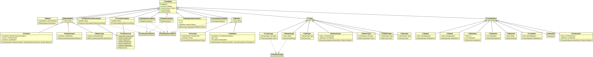
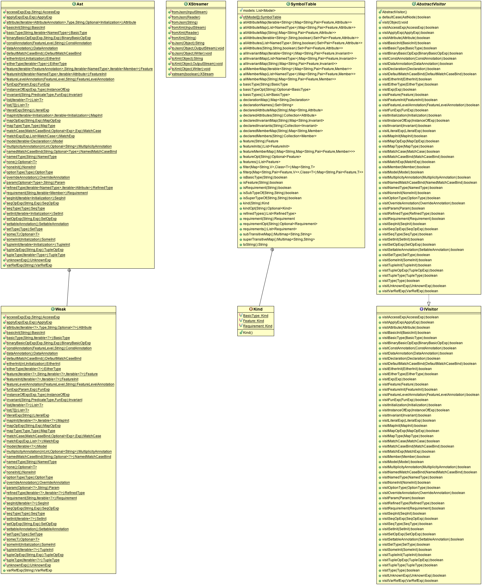

Language Specification, Representation, and API
===============================================

This section describes how device models can be specified in the Domain Specific
Language (DML) encoded in Scala. Note that because there are multiple ways to 
express the device models in Scala, the specification described here should not 
be treated as prescriptive. Instead, the specification is provided as a 
guideline for people that are not familiar with Scala (but familiar with Java) 
in order for the model to be accepted by the DML Scala Model Extractor; some 
possible variations are described on how one can express a model differently.

We will specify the context free grammar of the subset of Scala that is part of 
DML using the Extended Backus-Naur Format (EBNF). Specifically:

* Double quotes (``"`` ... ``"``)  delimit tokens
* Midbar (``|``) separates production alternatives
* Parenthesis ``(`` ... ``)`` groups rules
* Star character (``*``) denotes zero or more repetition of rules
* Plus character (``+``) denotes one or more repetition of rules
* Square brackets (``[`` ... ``]``) delimit optional rules
* ``ID`` denotes Java-like identifiers; a hint that starts with an underscore 
  (``_``) may be given to qualify what the identifier should refer to.
  For example, ``ID_basic`` indicates that it is an identifier of a basic type.
* Angle brackets (``<`` ... ``>``) denotes Scala entities whose specifications
  are not formally specified in the grammar. For example,  
  ``<scalaExp : java.lang.String(S)>`` denotes a Scala expression whose type
  resolves to some ``java.lang.String`` constant ``S`` such as ``"abc"``, which
  is equivalent to ``"a" + "bc"`` because the Scala compiler optimizes such
  static expression to a constant at compile time, hence, it not only knows that
  its type is ``java.lang.String``, but also that its value is ``"abc"`` at 
  runtime. The design intentions behind angle bracket-ed rules are explained as 
  the production rules using the angle brackets are discussed.

In addition, for the grammar productions, we describe the DML 
Abstract Syntax Tree (AST) Java classes defined in the package 
``edu.ksu.cis.santos.mdcf.dml.ast`` 
that are used to represent the productions, as well as AST constructor API
in ``edu.ksu.cis.santos.mdcf.dml.ast.Ast``, symbol table API 
in ``edu.ksu.cis.santos.mdcf.dml.symbol.SymbolTable``, 
and XML de/serialization API
in ``edu.ksu.cis.santos.mdcf.dml.serialization.XStreamer``.

   DML AST UML Class Diagram

   DML AST Constructors, Symbol Table, XML de/serialization API UML Class Diagram

Model
*****

.. productionlist:: DMS
   model               : `package` `imports` `declaration`*
   package             : "package" ( ID "." )* ID
   imports             : `importdms` `import`*
   importdms           : "import" "edu" "." "ksu" "." "cis" "." "santos" "." "mdcf" "." "dms" "." "_"
   import              : "import" ( ID "." )* ID [ "." "_" ]
   declaration         : `basicType` | `feature` | `requirement`

A model may be specified in multiple Scala source files. 
For each file, a model starts with a `package <#grammar-token-package>`__ 
declaration, followed by `import <#grammar-token-import>`__ declarations and 
declarations of `basic types <#grammar-token-basicType>`__, 
`features <#grammar-token-feature>`__, and 
`requirements <#grammar-token-requirement>`__. 
That is, it is assumed that models are
specified in a package other than the Scala or Java "default" package.
The grammar recommends importing all entities (specified using ``_`` instead of 
``*``  like in Java) defined in the ``edu.ksu.cis.santos.mdcf.dms`` 
`package <http://www.scala-lang.org/node/119>`__ and 
`package object <http://www.naildrivin5.com/scalatour/wiki_pages/PackageObjects>`__
(see ``mdcf/mdcf-dms-core/src/main/scala/edu/ksu/cis/santos/mdcf/dms/package.scala``), 
which defines DML primordial types, 
`implicit conversions <http://www.scala-lang.org/node/130>`__,
and a `macro <http://docs.scala-lang.org/overviews/macros/overview.html>`__, 
which will be described in the appropriate subsequent sections below.
 
In addition, it recommends importing `basic types <#grammar-token-basicType>`__ 
or `features <#grammar-token-feature>`__ defined in 
different packages; note that Scala allows import declarations to appear in many
places, including inside class declarations and expression blocks among others.

Basic Type
**********

.. productionlist:: DMS
   basicType           : `basicTypeTrait`
                       : | `basicTypeClass` `basicTypeObject`
   basicTypeTrait      : "trait" ID_basic "extends" ( "BasicType" | ID_basic ) [ `basicTypeBody` ]
   basicTypeClass      : [ `basicTypeModifier` ] [ "final" ] 
                       : "class" ID_basic "(" "val" "value" ":" <basicInternalType> ")"
                       : "extends" ( "BasicType" | ID_basic ) [ `basicTypeBody` ]
   basicTypeModifier   : "@Schema" | "@Class" | "@Product" | "@Instance"
   basicTypeObject     : "object" ID_basic "{" `basicTypeApply` "}"
   basicTypeApply      : "implicit" "def" "apply" "(" ID_apply ":" basicInternalType ")" "=" 
                       : "new" ID_basic "(" ID_apply ")"
   basicTypeBody       : "{" [ `basicAsStringMethod` ] [ `basicToStringMethod` ] <basicOpMethod>* "}"
   basicAsStringMethod : "override" "def" "asString" "=" <scalaExp : java.lang.String(S)>
   basicToStringMethod : "override" "def" "toString" "=" <scalaExp : java.lang.String(S)>

Feature and Requirement
***********************

.. productionlist:: DMS
   feature             : [ featureModifier ] ( "trait" | "class" ) ID_feature 
                       : "extends" ( "Feature" | `featureType` )
                       : "{" ( `attribute` [ `initialization` ] )* "}"
                       : [ `invariantObject` ] 
   featureModifier     : "@Schema" | "@Class" | "@Product" | "@Instance" | "@Data" | "@Settable"
   featureType         : ID_feature ( "with" ID_feature )*
   attribute           : [ `attributeModifier` ] "val" ID_attribute ":" `type`
   attributeModifier   : "@Data" | "@Settable" | "@Const" [ "(" `constMode` ")" ] 
   constMode           : "SCHEMA" | "CLASS" | "PRODUCT" | "INSTANCE" | "UNSPECIFIED"
   invariantObject     : "object" ID_feature "{" `invariant`* "}"
   invariant           : "@Inv" "val" ID_invariant ":" "Predicate" "[" `predicateType` "]" "="
                       : "pred" "{" ID ":" `predicateType` "=>" <scalaExp : Boolean> "}"
   predicateType       : `featureType`
                       : | "(" `featureType` ( "," `featureType` )+ ")"
   requirement         : "@Req" "object" ID_requirement "{" `invariant`* "}"

Type and Initialization
***********************
.. productionlist:: DMS
   type                : "Any" 
                       : | "Boolean" 
                       : | "Number" | "IntegralType" | "Int" | "Nat"
                       : | "String"
                       : | ID_basic 
                       : | "Option" "[" `type` "]" 
                       : | "Either" "[" `type` "," `type` "]"
                       : | "(" `type` ( "," `type` )+ ")" 
                       : | "Seq" "[" `type` "]" 
                       : | "Set" "[" `type` "]"
                       : | `featureType` [ "{" `attribute`* "}" ]
   initialization      : "true" | "false"
                       : | <scalaExp : Int(N)>
                       : | <scalaExp : java.lang.String(S)> 
                       : | "None" | "Some" "(" `initialization` ")"
                       : | "Left" "(" `initialization` ")" | "Right" "(" `initialization` ")"
                       : | "(" `initialization` ( "," `initialization` )+ ")"
                       : | "Seq" "(" [ `initialization` ( "," `initialization` )* ] ")"
                       : | "Set" "(" [ `initialization` ( "," `initialization` )* ] ")"
                       : | "new" `featureType` [ "{" `attributeInit` "}" ]
   attributeInit       : [ ( `attributeModifier` | "override" ) ] "val" ID_attribute ":" `type` "=" `initialization`
